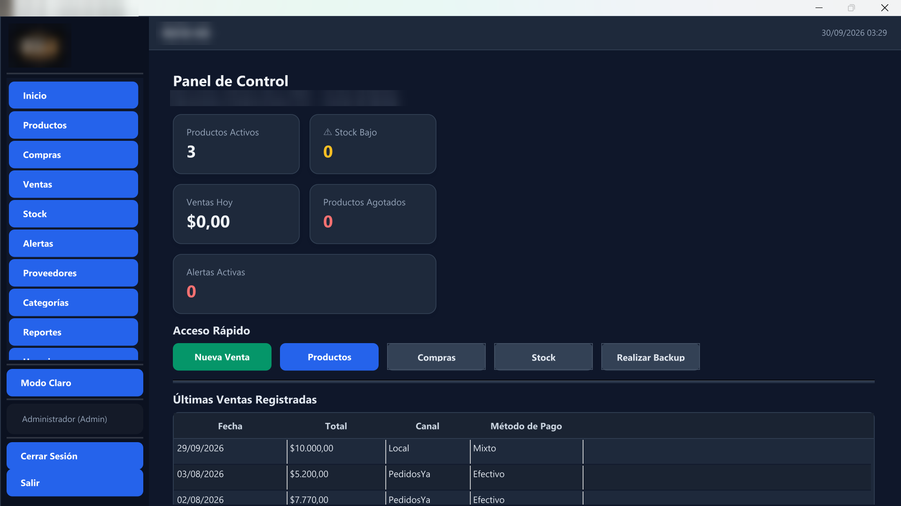
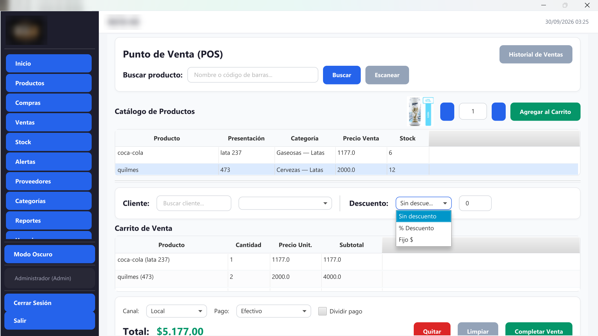
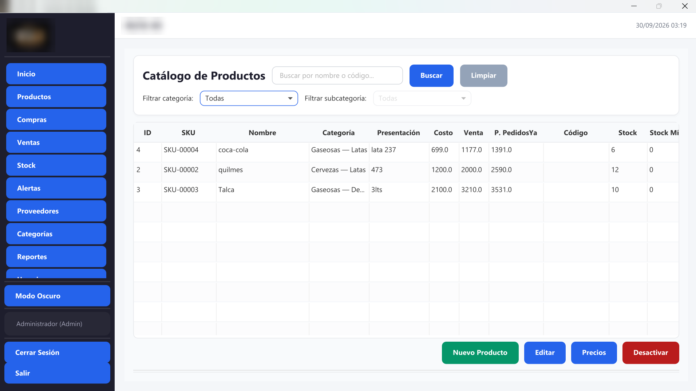
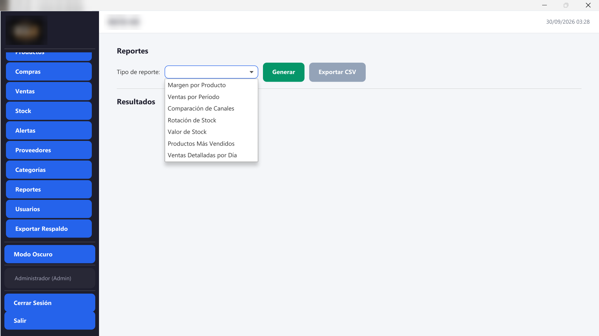
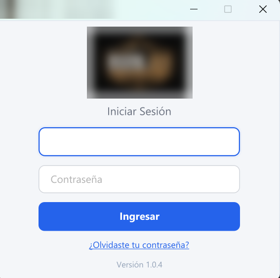
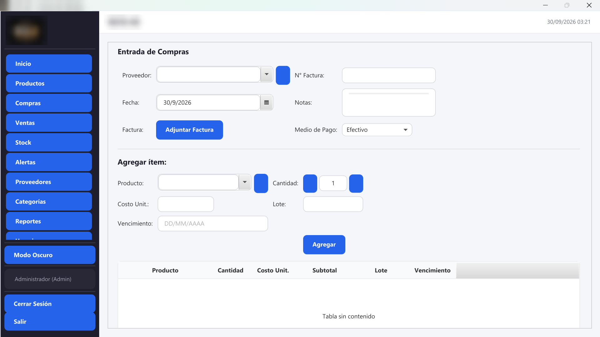
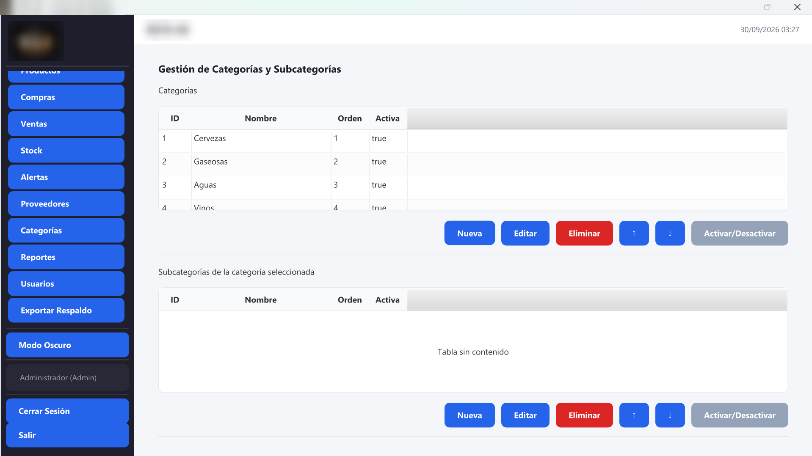
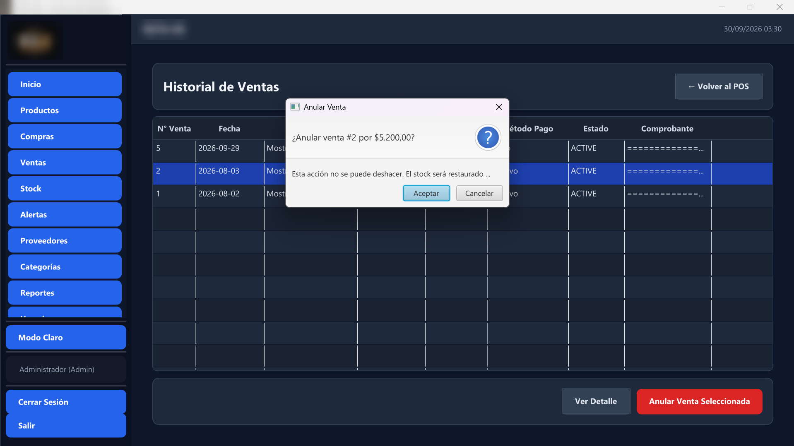

# Software de Bebidas — Sistema de gestión y punto de venta


Aplicación de escritorio para la gestión de negocios de bebidas. Incluye punto de venta (POS), control de stock, compras, alertas de vencimiento y reportes.

Está en uso real: es el sistema con el que un comercio de Mendoza, Argentina, gestiona su día a día.

## Capturas

<table>
  <tr>
    <td align="center"><strong>Panel de control (modo oscuro)</strong></td>
    <td align="center"><strong>Punto de venta</strong></td>
  </tr>
  <tr>
    <td></td>
    <td></td>
  </tr>
  <tr>
    <td align="center"><strong>Catálogo de productos</strong></td>
    <td align="center"><strong>Reportes</strong></td>
  </tr>
  <tr>
    <td></td>
    <td></td>
  </tr>
</table>

<details>
<summary><strong>Más capturas</strong></summary>
<br>

<table>
  <tr>
    <td align="center"><strong>Inicio de sesión</strong></td>
    <td align="center"><strong>Entrada de compras</strong></td>
  </tr>
  <tr>
    <td></td>
    <td></td>
  </tr>
  <tr>
    <td align="center"><strong>Categorías y subcategorías</strong></td>
    <td align="center"><strong>Historial y anulación de ventas</strong></td>
  </tr>
  <tr>
    <td></td>
    <td></td>
  </tr>
</table>

</details>

## Módulos

- **Panel de control:** resumen de stock, ventas del día, alertas y accesos rápidos.
- **Productos:** catálogo con búsqueda por nombre, código de barras o categoría; fotos; precios diferenciados para local y PedidosYa; actualización masiva de precios.
- **Proveedores:** gestión de distribuidores.
- **Compras:** registro con lotes y vencimientos, actualización automática de stock y adjunto de la foto de la factura.
- **Ventas (POS):** búsqueda rápida, escáner de código de barras, descuentos porcentuales o fijos, pago dividido en dos medios, canal Local/PedidosYa, historial con comprobante y anulación.
- **Stock:** vista en tiempo real, historial de movimientos y ajustes manuales.
- **Alertas:** productos próximos a vencer (7 días) y stock bajo el mínimo.
- **Reportes:** margen por producto, ventas por período, comparación de canales, rotación, valor de stock, más vendidos y ventas detalladas por día, con exportación a CSV.
- **Categorías:** jerarquía de categorías y subcategorías con orden personalizable.
- **Usuarios:** roles ADMIN y CAJERO, cambio de contraseña y protección del último administrador.
- **Datos del negocio:** nombre y logo del negocio, configurables por el administrador.
- **Respaldo:** backups automáticos programados y exportación manual.
- **Tema claro y oscuro.**

## Stack

| Tecnología | Versión | Uso |
|------------|---------|-----|
| Java | 17 (LTS) | Lenguaje base |
| JavaFX | 21 | Interfaz de escritorio (FXML + CSS) |
| SQLite | 3.46 (sqlite-jdbc) | Base de datos embebida |
| Maven | 3.9+ | Build y dependencias |
| JUnit 5, Mockito, AssertJ, TestFX | — | Testing |
| JaCoCo | 0.8.12 | Cobertura de código |

## Arquitectura

Patrón MVP (Model-View-Presenter) en capas, con SQLite embebida:

```
View (controllers FXML) → Presenter (lógica de UI) → Service (lógica de negocio) → Repository (JDBC) → SQLite
```

- **Migraciones** de base de datos versionadas, cada una con sus propios tests de actualización.
- **Seguridad:** consultas con PreparedStatement (sin SQL injection), contraseñas con BCrypt (los hashes SHA-256 antiguos se migran en el inicio de sesión) y sin conexión de red.
- **Rendimiento:** consultas por lotes para evitar N+1 en tablas, reportes y panel.

El detalle completo está en [ARCHITECTURE.md](ARCHITECTURE.md).

```
src/main/java/com/softwaredebebidas/
  SoftwareDeBebidasApp.java   Punto de entrada JavaFX
  Launcher.java               Punto de entrada para el empaquetado (jpackage)
  model/                      Entidades del dominio (Product, Sale, Purchase, User…)
  repository/                 DatabaseManager y repositorios JDBC
  service/                    Lógica de negocio
  presenter/                  Lógica de las pantallas
  view/                       Controllers FXML
  util/                       Formato de moneda, fechas, alertas, fotos, etc.
src/main/resources/
  fxml/                       Vistas
  styles.css, styles-dark.css Temas claro y oscuro
src/test/java/                Más de 100 clases de test (unitarios, integración y UI)
```

## Cómo ejecutar

Requisitos: JDK 17 y Maven 3.9+.

```bash
mvn clean javafx:run
```

**Primer ingreso:** usuario `admin`, contraseña `admin123`. El sistema obliga a cambiar la contraseña en el primer inicio de sesión. El nombre y el logo del negocio se configuran desde **Datos del negocio**.

## Cómo generar el instalador

```bash
mvn clean package -Pjpackage
```

Genera un instalador `.exe` en `dist/installer/`. No requiere tener Java instalado: incluye su propio entorno de ejecución y funciona en Windows 10 y 11.

Los datos se guardan en `%APPDATA%\software-bebidas\`. En el primer inicio, si no hay datos, la aplicación ofrece crear una base nueva o importar la carpeta de una instalación anterior.

## Cómo testear

```bash
mvn clean test                 # Ejecutar los tests
mvn test jacoco:report         # Tests + reporte de cobertura
```

## Desarrollo

Proyecto desarrollado por Pablo David Sánchez con asistencia de agentes de IA. El diseño funcional, la dirección técnica, la corrección de errores y el testing estuvieron a mi cargo.

## Agradecimientos

- **[Alan Buscaglia](https://github.com/Alan-TheGentleman)** ([Gentleman Programming](https://github.com/Gentleman-Programming)), por [Gentle AI](https://github.com/Gentleman-Programming/gentle-ai) y [Engram](https://github.com/Gentleman-Programming/engram). Su flujo de desarrollo guiado por especificaciones (SDD), sus agentes de revisión y su memoria persistente estuvieron presentes desde el primer día y guiaron la mayor parte del proyecto.
- **[OpenCode](https://opencode.ai)**, el entorno en el que se construyó la base de la aplicación.
- **[Claude Code](https://claude.com/claude-code)**, usado en las etapas finales de mejoras y presentación.

## Licencia

Software comercial. El código se publica solo para consulta y evaluación: se puede descargar, compilar y ejecutar localmente para evaluarlo (por ejemplo, en un proceso de selección), pero no usarlo en un negocio ni redistribuirlo sin un acuerdo con el autor. Ver [LICENSE](LICENSE).
